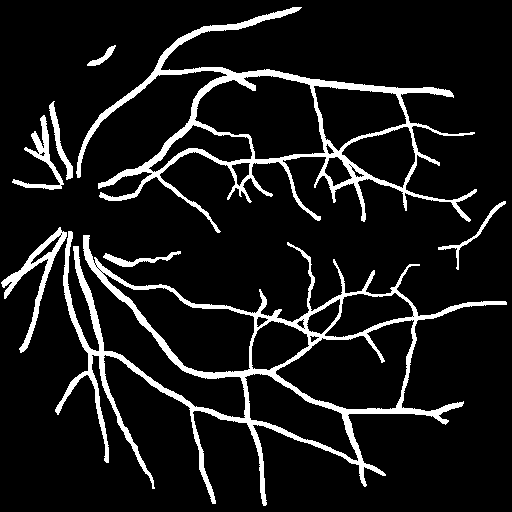
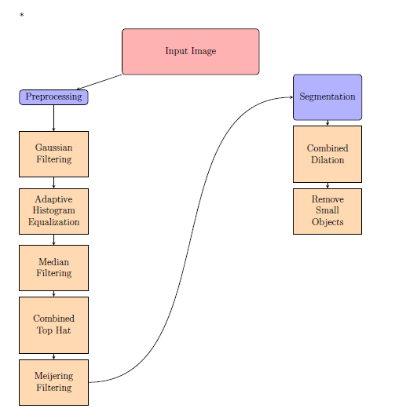

# Vessel-segmentation-CV

## Problem and goal of the project
Scanning laser ophthalmoscopy (SLO) is a retinal imaging modality that allows for high-resolution and wide-field fundus imaging, enabling the observation of the majority of the retina's surface at a resolution between 10 and 100 µm. In addition to retinal diseases, the observation of the fundus can diagnose several general pathologies by observing the arterial and venous circulation in the retina, such as hypertension and renal failure. The diagnosis generally relies on a quantitative analysis of the entire vascular network of the retinal image, requiring precise segmentation of this network. The goal of this project is to propose an automatic method for segmenting the vascular network in SLO retinal images.
<table>
  <tr>
    <td></td>
    <td></td>
  </tr>
</table>

## Data and computer tools
The data - images and annotations - are extracted from the IOSTAR database of the IDIAP for the evaluation of retinal vascular network segmentation algorithms. The TP-project can be entirely realized in Python. The provided script incorporates an evaluation function to measure the quality of the segmentation.

## Questions and reflection paths

The notion of multiscale is essential for this type of algorithm, as vessel thickness varies.
Since the vascular network is generally connected, the use of connected operators seems relevant.
The evaluation function provided in the Python script measures two metrics, Precision and Recall. The skeletonization plays a role in this evaluation function by thinning the segmented vessels, making it easier to compare with the ground truth.

